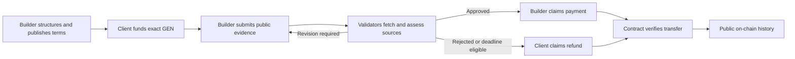

# ClauseFlow

**Service agreements whose payment is decided from public delivery evidence by GenLayer consensus.**

A Builder publishes objective terms. A Client locks the exact GEN price. After delivery, GenLayer validators independently fetch the submitted live app, repository, demo, and documentation, assess every accepted obligation, and reach consensus on whether escrow can be paid, revised, or refunded.

ClauseFlow is not an AI advice interface. The validator decision changes on-chain settlement rights.

| Surface | Link |
| --- | --- |
| Live dApp | [clauseflow-two.vercel.app](https://clauseflow-two.vercel.app) |
| Source | [github.com/tanphung/ClauseFlow](https://github.com/tanphung/ClauseFlow) |
| Current Bradbury contract | [0x0CfB...6Afe](https://explorer-bradbury.genlayer.com/address/0x0CfB5ba1505549c77Aa5854C523451a41C596Afe) |
| Deployment proof | [docs/DEPLOYMENT.md](docs/DEPLOYMENT.md) |
| Reviewer notes | [docs/SUBMISSION.md](docs/SUBMISSION.md) |
| CI | [GitHub Actions](https://github.com/tanphung/ClauseFlow/actions) |

> **Deployment note:** the current address is the clean Bradbury deployment of the richer validator review. Fresh two-wallet payment and refund histories are being created and verified before this release is submitted.


## Why This Needs GenLayer

A deterministic contract can enforce addresses, exact amounts, deadlines, revision limits, and one-time settlement. It cannot determine whether a delivered application actually implements an agreed workflow, whether repository and documentation evidence support the claim, or whether several public artifacts jointly satisfy natural-language acceptance criteria.

ClauseFlow uses GenLayer only at that trust boundary:

1. The funded clauses become the immutable review rubric.
2. Validators fetch the submitted public sources from inside the contract.
3. Each validator independently reasons over every accepted criterion and deliverable.
4. Consensus compares normalized material outcomes, not formatting or identical prose.
5. The agreed result changes who can claim the locked GEN.

Remove GenLayer and ClauseFlow can still store offers, but it cannot make the evidence-based settlement decision that defines the product.

## Agreement Lifecycle



Every deal keeps its accepted terms, parties, escrow amount, evidence package, review, timestamps, settlement state, and lifecycle events together. The public Dashboard reads this state directly from contract views and can filter agreements by Builder or Client address. There is no private history database and no seeded payment ledger.

## Validator Review

The current source release replaces keyword matching with a settlement-oriented evidence review:

- The leader and validators independently refetch all submitted sources.
- The LLM assesses every immutable criterion and deliverable semantically.
- Each assessment records `SATISFIED`, `PARTIAL`, `NOT_SATISFIED`, or `UNVERIFIABLE`.
- A positive assessment requires an accessible submitted URL, a concrete finding, and validator reasoning.
- The contract normalizes the assessments and deterministically derives the score and final result.
- Consensus requires agreement on the final decision, each obligation status, source accessibility, and score range.
- Free-form explanations may differ; settlement-critical fields may not.

The on-chain review record includes:

```text
executive summary
source accessibility and relevance
criterion-by-criterion findings and reasoning
deliverable-by-deliverable findings and reasoning
evidence URLs
verified strengths
risks and missing items
revision checklist and next action
consensus basis
```

Valid JSON alone proves nothing. An accessible page alone proves nothing. The fetched content must substantively support the accepted agreement.

## Settlement Safety

- `accept_offer` requires the exact integer attoGEN price.
- Approval, revision, rejection, deadlines, and exhausted revisions control eligible actions.
- Payment and refund are idempotent; a deal cannot settle twice.
- Claims first enter a pending state and emit the GEN transfer.
- Confirmation marks `PAID` or `REFUNDED` only after the contract balance proves escrow left the contract.
- The frontend requires both a successful transaction lifecycle and `FINISHED_WITH_RETURN`; `ACCEPTED` or `FINALIZED` alone is never shown as application success.

## Release Status

`main` contains the richer validator-review release described above. It was clean-deployed to Bradbury at [`0x0CfB5ba1505549c77Aa5854C523451a41C596Afe`](https://explorer-bradbury.genlayer.com/address/0x0CfB5ba1505549c77Aa5854C523451a41C596Afe) on 2026-07-23 with `ACCEPTED / AGREE / FINISHED_WITH_RETURN`, a valid 18-method schema, and `get_offer_ids=[]`.

Until the final smoke histories and recording are complete:

- the live dApp will be repointed to this contract after its Vercel production build completes;
- the existing two-deal history below remains archived proof of the previous release;
- the existing video documents the previous release and will be regenerated;
- this section will be replaced with fresh contract, transaction, and settlement evidence.

This explicit boundary keeps the repository, live evidence, and submission claims consistent.

## Archived Previous Bradbury History

This is retained as historical proof of the previous release. It is not the current vNext contract.

| Item | Verified value |
| --- | --- |
| Network | GenLayer Testnet Bradbury, chain ID `4221` |
| Contract | `0x993D37D07e31d8e3853B8702919f4d805299B124` |
| Deploy transaction | [`0xeb762c...3d02`](https://explorer-bradbury.genlayer.com/tx/0xeb762c3f00ebf8cc518e1c2a394b57f18b1d17cad0be4b61ad833a7b77f23d02) |
| Deploy result | `ACCEPTED / AGREE / FINISHED_WITH_RETURN` |
| Public schema | 18 methods: 9 writes and 9 views |
| Offers / deals / completed | `2 / 2 / 2` |
| Total funded | `0.035 GEN` |
| Total paid | `0.02 GEN` |
| Total refunded | `0.015 GEN` |
| Active deals / accounted escrow | `0 / 0 GEN` |

| Deal | Previous validator outcome | Settlement | Public evidence |
| --- | --- | --- | --- |
| `#1` ClauseFlow verified payment flow | `APPROVED`, `75/100` | `PAID`, `0.02 GEN` | [Live app](https://mochi-game-frontend.vercel.app/) and [repository](https://github.com/tanphung/Mochi-Game) |
| `#2` Mochi-Game accessibility audit | `REJECTED`, `50/100` | `REFUNDED`, `0.015 GEN` | Submitted sources plus recorded missing terms |

Exact deployment, review, payment, refund, child-transfer, and confirmation transaction IDs are in [docs/DEPLOYMENT.md](docs/DEPLOYMENT.md).

## Reviewer Path

The public read experience requires no wallet:

1. Open the [Dashboard](https://clauseflow-two.vercel.app) and compare its totals with the verified table above.
2. Open deal `#1`, inspect the expanded accepted agreement, evidence package, five-event lifecycle, and paid settlement.
3. Open deal `#2`, inspect the rejected review, refund path, and terminal history.
4. Filter the ledger by title, Builder address, or Client address.
5. Open **New offer** and confirm that the Builder workspace starts empty rather than presenting a fabricated contract.
6. Follow the contract and transaction links to verify state independently in the Bradbury explorer.

After the clean redeploy, this path will be updated with the new contract address, detailed review records, fresh two-wallet transactions, screenshots, and video.

## Architecture

| Layer | Responsibility |
| --- | --- |
| React dApp | Public dashboard, wallet roles, writes, transaction lifecycle, filters, and explorer proof |
| Intelligent Contract | Immutable terms, GEN escrow, evidence review, eligibility, settlement, statistics, and history |
| Bradbury validators | Independent web fetching and semantic assessment of settlement-critical obligations |
| Public evidence | Builder-supplied delivery, demo, documentation, and repository URLs |

Key contract methods:

| Stage | Methods |
| --- | --- |
| Draft and publish | `structure_offer`, `publish_offer`, `get_structured_offer`, `get_offer` |
| Fund and deliver | `accept_offer`, `submit_delivery` |
| Review | `review_delivery` |
| Settle | `claim_payment`, `confirm_payment`, `claim_refund`, `confirm_refund` |
| Public history | `get_deal`, `get_deal_ids`, `get_completed_deal_ids`, `get_deals_for_address`, `get_deal_history`, `get_dashboard_stats` |

See [docs/ARCHITECTURE.md](docs/ARCHITECTURE.md) and [contracts/clauseflow.py](contracts/clauseflow.py) for the full implementation.

## Repository Map

```text
contracts/clauseflow.py       GenLayer Intelligent Contract
src/                          React dApp and GenLayer integration
tests/direct/                 Contract state and settlement tests
tests/e2e/                    Desktop and mobile browser tests
scripts/                      Bradbury deploy, smoke, settlement, and demo tooling
docs/                         Architecture, proof, roadmap, and reviewer notes
public/config.js              Public Bradbury runtime configuration
```

## Run Locally

Frontend prerequisites: Node.js 22 or newer.

```powershell
npm ci
npm run dev
```

Open `http://127.0.0.1:5173`.

Contract tests additionally require Python 3.13, `genvm-lint`, and `gltest`.

```powershell
npm audit --omit=dev
npm test
npm run typecheck
npm run build
npm run test:e2e
npm run lint:contract
py -3.13 -m pytest tests/direct -q
```

Current verified gates:

- `0` known production dependency vulnerabilities
- `7/7` frontend component tests
- `6/6` direct contract tests
- desktop and mobile browser tests passed
- TypeScript, production build, GenVM lint, and GitHub CI passed

## Security

- Private keys remain only in local `.env` files or encrypted GenLayer keystores.
- `.env`, build output, test artifacts, generated media, and caches are ignored by Git.
- No private key is exposed through `VITE_*`, source, screenshots, logs, or documentation.
- Deployment preflight derives and verifies wallet addresses without printing secret values.
- Real smoke agreements use separate Builder and Client wallets and stay below `0.5 GEN`.

## Path Forward

ClauseFlow is one continuing product, not a family of template variations. The next release gate is a clean Bradbury deployment of the richer validator review, followed by fresh two-party payment and refund histories and a new reviewer video. Longer-term work includes reusable agreement templates, evidence policies, larger-history indexing, community pilot agreements, and mainnet readiness.

[Roadmap](docs/ROADMAP.md) | [Contribution and pilot guide](CONTRIBUTING.md) | [Submission notes](docs/SUBMISSION.md) | [Demo requirements](docs/DEMO_VIDEO.md)

Official GenLayer references: [Equivalence Principle](https://docs.genlayer.com/developers/intelligent-contracts/equivalence-principle), [value transfers](https://docs.genlayer.com/developers/intelligent-contracts/features/value-transfers), and [GenLayerJS contracts](https://docs.genlayer.com/api-references/genlayer-js/contracts).
