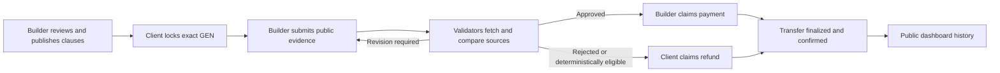

# ClauseFlow

**Verifiable service agreements and GEN escrow on GenLayer.**

ClauseFlow lets a Builder publish objective service terms, a Client fund the exact agreement with GEN, and GenLayer validators independently fetch public delivery evidence before the contract allows payment or refund. The public dashboard reads agreement, review, and settlement history directly from Bradbury contract views. There is no private history database or mocked agreement fallback.

[Live dApp](https://clauseflow-two.vercel.app) · [Bradbury contract](https://explorer-bradbury.genlayer.com/address/0x993D37D07e31d8e3853B8702919f4d805299B124) · [Reviewer notes](docs/SUBMISSION.md) · [Demo video package](docs/DEMO_VIDEO.md)


## The Trust Problem

Deterministic escrow can enforce roles, amounts, deadlines, and one-time settlement. It cannot determine whether a live application, repository, documentation set, or audit report actually satisfies a funded service agreement.

ClauseFlow uses GenLayer at that boundary:

1. The funded clauses become the immutable review standard.
2. Validators fetch the submitted delivery, demo, documentation, and repository URLs from the contract.
3. They compare accessible evidence with the agreed deliverables and acceptance criteria.
4. Consensus produces criteria-level findings and an `APPROVED`, `REVISION_REQUIRED`, or `REJECTED` decision.
5. That decision controls whether escrow can move to the Builder or return to the Client.

This is a settlement decision over real GEN, not an off-chain recommendation or a validator that only checks JSON formatting. `structure_offer` helps normalize draft terms, but it cannot release funds and the Builder must review and publish the clauses explicitly. The contract-critical trust decision is `review_delivery`.

Deadline, grace period, revision exhaustion, refund eligibility, escrow accounting, and settlement idempotency remain deterministic contract rules.

## Verified Bradbury State

The following state was read again from the deployed contract on **2026-07-23**.

| Item | Verified value |
| --- | --- |
| Network | GenLayer Testnet Bradbury, chain ID `4221` |
| Contract | `0x993D37D07e31d8e3853B8702919f4d805299B124` |
| Deploy transaction | `0xeb762c3f00ebf8cc518e1c2a394b57f18b1d17cad0be4b61ad833a7b77f23d02` |
| Deploy result | `ACCEPTED / AGREE / FINISHED_WITH_RETURN` |
| Public schema | 18 methods: 9 writes and 9 views |
| Offers / deals / completed | `2 / 2 / 2` |
| Total funded | `0.035 GEN` |
| Total paid | `0.02 GEN` |
| Total refunded | `0.015 GEN` |
| Active deals / contract escrow | `0 / 0 GEN` |

| Deal | Validator outcome | Settlement | Evidence |
| --- | --- | --- | --- |
| `#1` ClauseFlow verified payment flow | `APPROVED`, score `75/100` | `PAID`, `0.02 GEN` | [Mochi-Game live app](https://mochi-game-frontend.vercel.app/) and [source](https://github.com/tanphung/Mochi-Game) |
| `#2` Mochi-Game accessibility audit agreement | `REJECTED`, score `50/100` | `REFUNDED`, `0.015 GEN` | Validators fetched the submitted sources and recorded missing funded criteria |

Amounts are displayed in human-readable GEN. The contract stores exact integer attoGEN values internally.

Detailed deployment and settlement transaction IDs are recorded in [docs/DEPLOYMENT.md](docs/DEPLOYMENT.md).

## Reviewer Walkthrough

The live app is public and does not require a wallet for review.

1. Open the [Dashboard](https://clauseflow-two.vercel.app) and verify the totals above.
2. Open deal `#1`. Its full accepted terms are expanded by default. Review the public evidence, criteria-level findings, and five-event lifecycle ending in `PAID`.
3. Open deal `#2`. Review the unmet criteria and lifecycle ending in `REFUNDED`.
4. Filter the ledger by title, Builder address, or Client address.
5. Open **New offer** to confirm the Builder workspace starts empty and requires explicit scope, evidence, acceptance, payment, deadline, revision, and refund terms.
6. Use the contract explorer link in the sidebar to inspect the deployed Intelligent Contract.

The polished 1080p reviewer recording, thumbnail, suggested upload copy, and chapter timestamps are described in [docs/DEMO_VIDEO.md](docs/DEMO_VIDEO.md).

## Lifecycle



## Architecture

| Layer | Responsibility |
| --- | --- |
| React frontend | Wallet connection, writes, full transaction lifecycle, public views, filters, explorer links |
| Intelligent Contract | Accepted terms, GEN escrow, deterministic eligibility, evidence review, settlement, aggregate stats, per-deal history |
| Bradbury validators | Independent public web fetching and consensus over material evidence findings |
| Public evidence | Live delivery, demo, documentation, and repository URLs supplied by the Builder |

The frontend waits for a real execution result and refreshed contract state. It never treats `ACCEPTED` or `FINALIZED` alone as proof of application success.

Payment and refund use two-step settlement. A claim emits the external GEN transfer and records a pending state. Confirmation marks the deal `PAID` or `REFUNDED` only after the contract balance proves escrow left the contract. Repeated settlement is rejected.

See [docs/ARCHITECTURE.md](docs/ARCHITECTURE.md) and [contracts/clauseflow.py](contracts/clauseflow.py) for the complete design and implementation.

## Repository

```text
contracts/clauseflow.py       Intelligent Contract
src/                          React dApp and GenLayer integration
tests/direct/                 Direct contract tests
tests/e2e/                    Desktop and mobile browser tests
scripts/                      Bradbury deploy, smoke, settlement, and demo tooling
docs/                         Architecture, deployment, demo, roadmap, and reviewer notes
public/config.js              Public Bradbury runtime configuration
```

## Run Locally

Node.js 22 or newer is required for the frontend.

```powershell
npm ci
npm run dev
```

Then open `http://127.0.0.1:5173`. Optional contract tooling requires Python 3.13, GenLayer CLI, `genvm-lint`, and `gltest`.

## Verification

```powershell
npm audit --omit=dev
npm test -- --run
npm run typecheck
npm run build
npm run test:e2e
npm run lint:contract
py -3.13 -m pytest tests/direct -q
```

Verified release gate:

- npm audit: 0 known production dependency vulnerabilities
- frontend component tests: 6 passed
- direct contract tests: 5 passed
- desktop/mobile browser tests: 6 passed
- TypeScript, production build, GenVM lint, Bradbury payment smoke, and Bradbury refund smoke: passed
- latest GitHub Actions workflow: passed

## Security

- Private keys remain only in local `.env` or encrypted GenLayer keystores.
- `.env`, build output, test artifacts, generated video, and caches are ignored by Git.
- The browser receives only public chain, explorer, and contract configuration.
- Deployment preflight derives and checks the deployer address without printing secret values.
- Every smoke agreement uses separate Builder and Client wallets and less than `0.5 GEN`.

## Project Direction

ClauseFlow is one continuing product, not a set of template variations. The next milestones are reusable agreement templates, richer evidence policies, optional event indexing for larger histories, community pilot agreements, and mainnet readiness.

- [Roadmap](docs/ROADMAP.md)
- [Contribution and pilot guide](CONTRIBUTING.md)
- [Submission notes](docs/SUBMISSION.md)
- [Demo video and upload copy](docs/DEMO_VIDEO.md)

Official GenLayer references: [value transfers](https://docs.genlayer.com/developers/intelligent-contracts/features/value-transfers), [messages](https://docs.genlayer.com/developers/intelligent-contracts/features/messages), and [genlayer-js contracts](https://docs.genlayer.com/api-references/genlayer-js/contracts).
