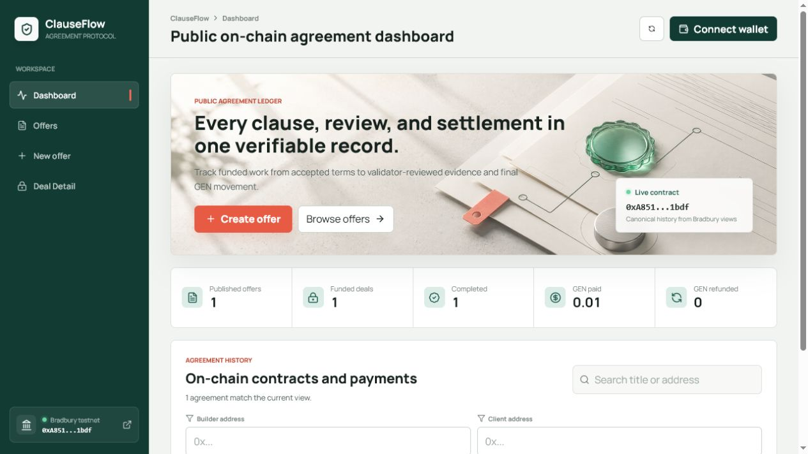
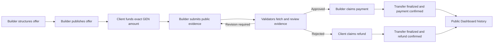

# ClauseFlow

ClauseFlow is a two-party service agreement dApp on GenLayer. Builders publish precise work offers, Clients fund them with GEN, and the Intelligent Contract evaluates public delivery evidence before allowing payment or refund. The public Dashboard reads the complete agreement and settlement history from on-chain views.



## Why GenLayer

ClauseFlow does not attach consensus to generic AI output. GenLayer is used at two contract-critical moments:

1. `structure_offer` turns a Builder's rough service scope into a complete, ready-to-accept agreement. Validators check material drafting fields such as specific scope, testable deliverables, objective acceptance criteria, evidence requirements, payment terms, refund terms, and source coverage.
2. `review_delivery` evaluates public delivery evidence against the exact funded agreement before payment or refund can proceed.

During `review_delivery`, every validator can independently:

1. fetch the submitted delivery, demo, documentation, and GitHub URLs;
2. compare the fetched content with the funded scope, deliverables, and acceptance criteria;
3. derive `APPROVED`, `REVISION_REQUIRED`, or `REJECTED`;
4. compare material result fields, evidence accessibility, score thresholds, and criteria coverage.

The outcome changes who can receive escrowed GEN, which is why these decisions belong in a GenLayer Intelligent Contract instead of an off-chain AI service.

## Lifecycle



Deadline, grace period, revision exhaustion, refund eligibility, escrow accounting, and idempotency are deterministic contract rules.

## Bradbury Deployment Status

Clean contract deployment is verified for this version.

- Network: GenLayer Testnet Bradbury, chain ID `4221`
- Contract: `0xA851b0D3cD85f5Abc91E459C172bc326d5A41bdf`
- Deploy tx: `0x08b7d84fc341dbe035b00027eaa62acb7f56f97047e8350e870c955f5e1f3ad2`
- Deploy result: `ACCEPTED / AGREE / FINISHED_WITH_RETURN`
- Verified schema: 18 public methods, 9 writes and 9 views
- Verified views: `get_offer_ids`, `get_deal_ids`, `get_dashboard_stats`
- Verified smoke: deal `1` completed as `PAID` with `0.01 GEN` paid from escrow after public Mochi-Game evidence review.

The intended smoke scenario now uses the user's real Mochi-Game evidence:

- GitHub: [tanphung/Mochi-Game](https://github.com/tanphung/Mochi-Game)
- Live app: [mochi-game-frontend.vercel.app](https://mochi-game-frontend.vercel.app/)
- Agreement: audit and polish the Mochi-Game Quest Evaluator reviewer path
- Test value: below `0.5 GEN`

## Contract API

Contract source: [`contracts/clauseflow.py`](contracts/clauseflow.py)

Writes:

- `structure_offer`
- `publish_offer`
- `accept_offer` (payable, exact amount)
- `submit_delivery`
- `review_delivery`
- `claim_payment` / `confirm_payment`
- `claim_refund` / `confirm_refund`

Views:

- `get_offer_ids` / `get_offer`
- `get_deal_ids` / `get_deal`
- `get_completed_deal_ids`
- `get_deals_for_address`
- `get_deal_history`
- `get_dashboard_stats`
- `get_structured_offer`

The two-step settlement state reflects GenLayer external-message semantics: a claim emits the GEN transfer and records a pending state; confirmation marks `PAID` or `REFUNDED` only after the contract balance proves that escrow left the contract. Repeated settlement is rejected.

## Dashboard

The React app has no mock agreement fallback. It reads canonical offers, deals, aggregate totals, and per-deal timelines from the configured Bradbury contract.

`public/config.js` points to the verified clean Bradbury contract above.

- Public totals for offers, funded/active/completed deals, paid GEN, and refunded GEN
- Builder, Client, and title/address filters
- Full agreement detail with accepted clauses and delivery evidence
- Lifecycle timeline from funding through review and settlement
- Transaction hash, explorer link, consensus result, execution result, and child transfer IDs
- Explicit loading, empty, indexing-delay, and failure states

Runtime public configuration is in [`public/config.js`](public/config.js). Private keys must stay only in local `.env` or encrypted GenLayer keystores.

## Local Development

Requires Node.js 22+, Python 3.13 for direct tests on Windows, GenLayer CLI, `genvm-lint`, and `gltest`.

```powershell
npm install
npm run dev
```

Open `http://127.0.0.1:5173` while the dev server is running.

## Verification

```powershell
npm audit
npm test
npm run typecheck
npm run build
genvm-lint check contracts/clauseflow.py --json
py -3.13 -m pytest tests/direct/ -q
npm run test:e2e
```

Current local verification:

- GenVM lint: 18 methods validated
- Direct contract tests: 5 passed
- Frontend unit tests: 5 passed
- TypeScript typecheck and production build: passed
- Browser E2E suite: desktop and mobile coverage

The direct-test fixture includes a Windows-only stdin cleanup workaround for a `gltest` temporary-file lock; it does not change contract behavior.

## Deployment Safety

`.env`, keystores, private keys, build artifacts, test output, and caches are excluded by `.gitignore`. The frontend receives only public chain configuration. Before any deployment, the local deployer address is checked against `EXPECTED_WALLET_ADDRESS` without printing secret values.

Official references:

- [GenLayer value transfers](https://docs.genlayer.com/developers/intelligent-contracts/features/value-transfers)
- [GenLayer messages](https://docs.genlayer.com/developers/intelligent-contracts/features/messages)
- [genlayer-js contract API](https://docs.genlayer.com/api-references/genlayer-js/contracts)

## Submission

Full source repository: [github.com/tanphung/ClauseFlow](https://github.com/tanphung/ClauseFlow)

ClauseFlow is being developed as one substantial Project rather than a family of template variations. The reviewer package documents the real trust problem, contract-critical use of validator consensus, verified claims, and the exact demo path:

- [Reviewer submission notes](docs/SUBMISSION.md)
- [Three-minute demo script](docs/DEMO_SCRIPT.md)
- [Focused product roadmap](docs/ROADMAP.md)
- [Contribution and pilot guide](CONTRIBUTING.md)

Do not submit the final Project until the public app is hosted and the clean-deployment refund smoke is verified. The current paid Mochi-Game agreement is already visible through the Bradbury-backed Dashboard.
