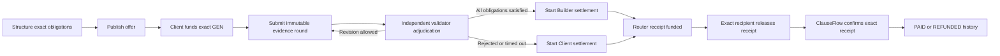

# ClauseFlow

**Evidence-verified service agreements with enforceable acceptance terms.**

ClauseFlow is a two-party service agreement dApp for GenLayer. A Builder publishes an exact obligation manifest, a Client locks the exact GEN price, and protocol-selected validators independently verify immutable public evidence. The consensus result changes who may settle the escrow.

ClauseFlow uses AI only where deterministic code cannot: deciding whether public delivery evidence materially satisfies natural-language obligations. It is not an advice, summary, or recommendation app.

## Why This Version Is Different

The v2 release directly addresses four settlement gaps:

1. **Every accepted obligation is adjudicated.** Each funded obligation has a stable ID, category, binding statement, acceptance rule, and required evidence types. The validator report must return exactly that obligation set, with no omitted or invented items.
2. **Revision and refund terms execute as funded.** Delivery, grace, revision, revision-window, review-timeout, and rejection rules are deterministic contract checks. They are not left to AI interpretation.
3. **Evidence is version-bound.** Every submitted source declares an evidence ID, type, immutable version kind and ID, version-bearing HTTPS URL, and SHA-256 digest. Evidence rounds are append-only.
4. **Settlement is deal-specific.** A dedicated EVM `SettlementRouter` stores the exact deal hash, recipient, amount, settlement kind, source contract, and release state. ClauseFlow records `PAID` or `REFUNDED` only when that exact receipt matches.

These controls keep the accepted agreement and the executable settlement policy aligned.

## Release Status

The v2 contract pair is clean-deployed and verified on Bradbury. The public runtime now targets v2; the two end-to-end pilot settlements remain pending and will be documented only after their exact receipts and terminal states are verified.

| Surface | Link |
| --- | --- |
| Live dApp | [clauseflow-two.vercel.app](https://clauseflow-two.vercel.app) |
| Source repository | [github.com/tanphung/ClauseFlow](https://github.com/tanphung/ClauseFlow) |
| Intelligent Contract | [contracts/clauseflow.py](contracts/clauseflow.py) |
| Settlement Router source | [contracts/SettlementRouter.sol](contracts/SettlementRouter.sol) |
| Bradbury v2 | [`0x541139...49c9F`](https://explorer-bradbury.genlayer.com/address/0x5411398e4f4AA26dCdBD7E1Af9C876189BD49c9F) |
| Settlement Router | [`0x645143...f2dd6`](https://explorer-bradbury.genlayer.com/address/0x645143380d78af86f7528c057c0a1b1ca10f2dd6) |
| Architecture | [docs/ARCHITECTURE.md](docs/ARCHITECTURE.md) |
| Release evidence dossier | [docs/RELEASE_EVIDENCE.md](docs/RELEASE_EVIDENCE.md) |
| Security boundaries | [SECURITY.md](SECURITY.md) |

The earlier walkthrough on [X](https://x.com/tanphung000/status/2088260443752243463) documents the v1 pilot only. A new v2 video will be recorded after final on-chain verification.

The v2 deployment transaction is [`0x28f7e7...4d7f7`](https://explorer-bradbury.genlayer.com/tx/0x28f7e7621468ed34eaa9adba8f15045b3d40c9d90f9c8b3efc0e0537b784d7f7): `FINALIZED / AGREE / FINISHED_WITH_RETURN`. The Router binding transaction is [`0x44019d...5ba3d`](https://explorer-bradbury.genlayer.com/tx/0x44019ddd9f7ec2be24df4c478b0641da0e06a25ef3109b6d2ed3d7feb105ba3d). Verification returned 21 methods, `CLAUSEFLOW_V2`, and empty initial offer and deal lists.

## Trust And Consensus

A conventional escrow can enforce addresses, exact amounts, deadlines, counters, and one-time settlement. It cannot establish whether a deployed application, source tree, audit, report, or other public artifact satisfies a funded natural-language promise.

ClauseFlow reserves GenLayer consensus for that evidence judgment:

1. The Builder structures every binding promise as an explicit obligation.
2. The Client accepts that exact manifest and locks the exact price.
3. The Builder submits an immutable, digest-bound evidence manifest.
4. A leader fetches the sources and produces a structured assessment for every funded obligation.
5. Protocol-selected validators independently refetch the sources and verify accessibility, versions, hashes, exact obligation coverage, findings, reasoning, score, missing items, and settlement decision.
6. Matching JSON or matching prose is insufficient. The material findings must be supported by the independently fetched evidence.
7. Deterministic contract logic applies the funded revision or refund policy to the consensus result.

The frontend only renders fields stored by the contract. It does not manufacture validator analysis, rationale, or evidence conclusions.

## Lifecycle


```mermaid
flowchart LR
  A[Structure exact obligations] --> B[Publish offer]
  B --> C[Client funds exact GEN]
  C --> D[Submit immutable evidence round]
  D --> E[Independent validator adjudication]
  E -->|All obligations satisfied| F[Start Builder settlement]
  E -->|Revision allowed| D
  E -->|Rejected or timed out| G[Start Client settlement]
  F --> H[Router receipt funded]
  G --> H
  H --> I[Exact recipient releases receipt]
  I --> J[ClauseFlow confirms exact receipt]
  J --> K[PAID or REFUNDED history]
```

## Executable Terms

### Obligations

An offer contains between 1 and 12 obligations. Each obligation includes a stable unique ID, category, binding statement, separately testable acceptance rule, and one or more required evidence types.

Funding freezes the obligation JSON and its hash. `review_delivery` requires exactly one assessment for every frozen ID. Duplicate, missing, extra, or malformed assessments are rejected before state changes.

### Evidence

Each evidence round contains between 1 and 8 sources. A source includes its stable ID, evidence type, label, immutable version kind, version ID, version-bearing HTTPS URL, and expected SHA-256 digest. Supported version bindings are Git commits, IPFS CIDs, and immutable Vercel deployment URLs.

Submission rounds are append-only. A revision creates a new evidence round; it never overwrites the prior record.

### Revision And Refund

Deterministic timestamps govern the delivery deadline plus grace period, maximum revision rounds, revision submission window, validator review timeout, and refund eligibility after rejection or timeout.

The AI report cannot extend a funded deadline, grant an extra revision, change a recipient, or change an amount.

### Exact Settlement Receipt

`claim_payment` and `claim_refund` start a router settlement containing the exact deal-specific fields. The designated recipient releases that router receipt after the parent GenLayer transaction finalizes. `confirm_payment` or `confirm_refund` succeeds only if the router proves all of these fields together:

- settlement ID and deal hash;
- ClauseFlow source contract;
- recipient;
- exact attoGEN amount;
- payment or refund kind;
- `RELEASED` state.

This prevents an unrelated transfer or aggregate balance change from completing another deal.

## Contract Surface

The Intelligent Contract exposes 21 methods: 9 writes and 12 views.

| Phase | Methods |
| --- | --- |
| Offer | `structure_offer`, `publish_offer`, `get_structured_offer`, `get_offer`, `get_offer_ids` |
| Funding | `accept_offer` |
| Evidence | `submit_delivery`, `get_evidence_rounds` |
| Adjudication | `review_delivery`, `get_refund_eligibility` |
| Settlement | `claim_payment`, `confirm_payment`, `claim_refund`, `confirm_refund` |
| Public history | `get_deal`, `get_deal_ids`, `get_completed_deal_ids`, `get_deals_for_address`, `get_deal_history`, `get_dashboard_stats` |
| Policy | `get_protocol_policy` |

## Frontend

The public dashboard requires no wallet. It reads canonical contract views and exposes agreement terms, immutable evidence rounds, per-obligation validator reasoning, refund eligibility, exact router receipt fields, settlement history, filters, and explorer links.

A contract-bound snapshot provides immediate first paint while Bradbury refreshes in the background. The snapshot is accepted only when its network, contract address, protocol version, and router address match runtime configuration. Live views replace it after a successful refresh.

Wallet connection uses EIP-6963 discovery and supports compatible injected wallets, including OKX Wallet and MetaMask. Write success requires finalized agreement, `FINISHED_WITH_RETURN`, and the expected refreshed contract state.

## Local Verification

Requirements: Node.js 22+, Python 3.13, GenLayer CLI, `genvm-lint`, and a Chrome-compatible browser.

```powershell
npm ci
npm audit --omit=dev
npm run lint:contract
py -3.13 -m pytest tests/direct -q
npm test
npm run typecheck
npm run build
npm run test:e2e
```

Run the dApp locally:

```powershell
npm run dev
```

Open `http://127.0.0.1:5173`.

## Repository Map

```text
contracts/clauseflow.py          GenLayer obligation and adjudication contract
contracts/SettlementRouter.sol  Deal-specific EVM settlement receipts
src/                            React dApp and typed contract integration
tests/direct/                   Contract state and policy tests
tests/router/                   Router authorization and receipt tests
tests/e2e/                      Desktop and responsive browser checks
scripts/                        Preflight, deploy, resumable pilot, snapshot, video
docs/                           Architecture, evidence, deployment, reviewer notes
```

ClauseFlow is submitted as one complete **Project**, not as a separately extracted Intelligent Contract or Milestone.
