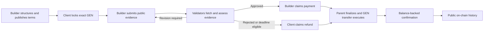

# ClauseFlow

**Evidence-based service agreements settled by GenLayer consensus.**

ClauseFlow lets a Builder publish objective service terms and a Client lock the exact GEN price. Bradbury validators fetch public delivery evidence, assess it against immutable clauses, and change on-chain settlement rights. This public README is the reviewer documentation for the funded release; ClauseFlow is not an AI advice interface.

**Paid release agreement:** the Client locked exactly `0.02 GEN`; `APPROVED` permits Builder payment; one revision is allowed within 24 hours; and `REJECTED` or deadline plus the 24-hour grace period permits Client refund. A separate `0.015 GEN` accessibility-audit agreement intentionally demonstrates truthful non-delivery, validator rejection, and Client refund. In both paths, external transfers execute after parent finalization, and terminal `PAID` or `REFUNDED` state requires balance confirmation.

| Method | Live interface | README consequence |
| --- | --- | --- |
| `publish_offer` | New offer | publish immutable terms |
| `accept_offer` | Fund exact GEN | lock the exact displayed amount |
| `submit_delivery` | Evidence submission | store public delivery URLs |
| `review_delivery` | Validator review | decide approval, revision, or rejection |
| `claim_payment` | Deal Detail / Settlement / Claim payment | emit Builder transfer after `APPROVED` |
| `confirm_payment` | Deal Detail / Settlement / Confirm payment | balance-prove terminal `PAID` |
| `claim_refund` | Deal Detail / Settlement / Claim refund | emit Client transfer after `REJECTED` or deadline eligibility |
| `confirm_refund` | Deal Detail / Settlement / Confirm refund | balance-prove terminal `REFUNDED` |
| `get_deal_history` | On-chain history | read canonical lifecycle events |
| `get_dashboard_stats` | Protocol summary | read funded, paid, and refunded totals |

## Live Release

| Surface | Verified release |
| --- | --- |
| Live dApp | [clauseflow-two.vercel.app](https://clauseflow-two.vercel.app) |
| Source repository | [github.com/tanphung/ClauseFlow](https://github.com/tanphung/ClauseFlow) |
| Bradbury contract | [`0xF85C...e63D`](https://explorer-bradbury.genlayer.com/address/0xF85C4460B8195F9ebFD7b376c852aD7E89Ffe63D) |
| Deployment transaction | [`0x3e2a...e5737`](https://explorer-bradbury.genlayer.com/tx/0x3e2ad3fd2f4c980dc5d481d253e072b501a0508206a3f6c91245e2dc538e5737) |
| Contract source | [contracts/clauseflow.py](contracts/clauseflow.py) |
| Release evidence matrix | [docs/RELEASE_EVIDENCE.md](docs/RELEASE_EVIDENCE.md) |
| Reviewer notes | [docs/SUBMISSION.md](docs/SUBMISSION.md) |
| Security and limitations | [SECURITY.md](SECURITY.md) |
| Release checklist | [docs/RELEASE_CHECKLIST.md](docs/RELEASE_CHECKLIST.md) |

The deployment is `FINALIZED / AGREE / FINISHED_WITH_RETURN`, exposes 18 methods, began with `get_offer_ids=[]`, and matches the repository contract source byte-for-byte after newline normalization. Its two-wallet Bradbury pilot now contains one `PAID` agreement after an `APPROVED` `100/100` review and one `REFUNDED` agreement after a `REJECTED` `0/100` review. Canonical totals are `0.035 GEN` funded, `0.02 GEN` paid, `0.015 GEN` refunded, and zero active escrow.

## The Trust Problem

A deterministic escrow can enforce roles, exact amounts, deadlines, revision limits, and one-time settlement. It cannot establish whether a live application, source tree, documentation set, or other public artifact actually satisfies natural-language delivery obligations.

ClauseFlow uses GenLayer only at that boundary:

1. The Builder deterministically structures complete clauses and publishes the offer without AI rewriting the accepted obligations.
2. The Client funds the exact immutable price.
3. The Builder submits public delivery, source, demo, and documentation URLs.
4. The contract fetches those sources inside `review_delivery`.
5. A leader produces a detailed criterion-by-criterion settlement report.
6. Validators treat the leader report as untrusted, independently refetch the evidence, and verify its source accessibility, criterion coverage, deliverable coverage, missing items, score, and settlement decision.
7. Consensus accepts the detailed report only when every material verification flag is true and no unsupported claim remains. Valid JSON, URL accessibility, keyword overlap, or matching prose alone is insufficient.
8. The agreed result determines whether the Builder can claim payment or the Client can claim a refund.

Valid JSON is not enough. URL accessibility is not enough. The public content must materially support the funded obligations.

## Agreement Lifecycle


```mermaid
flowchart LR
  A[Builder structures and publishes terms] --> B[Client locks exact GEN]
  B --> C[Builder submits public evidence]
  C --> D[Validators fetch and assess evidence]
  D -->|Approved| E[Builder claims payment]
  D -->|Revision required| C
  D -->|Rejected or deadline eligible| F[Client claims refund]
  E --> G[Parent finalizes and GEN transfer executes]
  F --> G
  G --> H[Balance-backed confirmation]
  H --> I[Public on-chain history]
```

| Contract method | Product action | Public proof |
| --- | --- | --- |
| `structure_offer` | Structure complete clauses | Builder draft |
| `publish_offer` | Publish immutable terms | Offers view |
| `accept_offer` | Lock exact GEN | Funded deal |
| `submit_delivery` | Submit public evidence | Evidence package |
| `review_delivery` | Reach validator decision | Detailed review report |
| `claim_payment` | Emit Builder payment | Pending settlement + child transfer |
| `confirm_payment` | Verify escrow decrease | `PAID` history |
| `claim_refund` | Emit Client refund | Pending settlement + child transfer |
| `confirm_refund` | Verify escrow decrease | `REFUNDED` history |
| `get_deal_history` | Read lifecycle events | Deal timeline |
| `get_dashboard_stats` | Read aggregate settlement | Dashboard totals |

## Validator Report

Every completed review stores more than a PASS label:

- executive summary and final decision;
- source-by-source accessibility, finding, and relevance;
- criterion and deliverable status: `SATISFIED`, `PARTIAL`, `NOT_SATISFIED`, or `UNVERIFIABLE`;
- concrete findings, validator reasoning, and supporting evidence URLs;
- strengths, risks, missing items, revision checklist, and next action;
- a concise explanation of the consensus basis.

The contract deterministically derives the score and settlement result from normalized assessments. Approval requires every material obligation to be satisfied and a score of 100.

## Settlement Safety

- `accept_offer` rejects any amount other than the exact integer attoGEN price.
- Deal terms, parties, amount, evidence, review, timestamps, and settlement stay in one on-chain record.
- Payment and refund are mutually exclusive and cannot be claimed twice.
- A claim first enters `PAYMENT_PENDING` or `REFUND_PENDING` and emits an external GEN transfer.
- External transfer execution follows parent finalization.
- Confirmation marks `PAID` or `REFUNDED` only after the contract balance proves escrow left the contract.
- The frontend requires successful execution and consensus, then refreshes contract state; lifecycle status alone is never presented as application success.

## Public Dashboard

The Dashboard reads contract views directly and requires no wallet. It exposes:

- total offers, funded deals, completed deals, GEN paid, and GEN refunded;
- agreement history filtered by title, Builder address, or Client address;
- accepted clauses expanded by default;
- submitted evidence and detailed validator reasoning;
- lifecycle events and explorer links;
- a versioned, timestamped release snapshot for immediate first paint while live Bradbury views refresh in the background;
- lazy offer and history reads only when those views are opened;
- strict network and contract-address validation so snapshots never cross deployments.

Live contract views always replace the snapshot after a successful refresh. If Bradbury is temporarily unavailable, the UI keeps the verified snapshot visible and labels the degraded state instead of showing an empty or fabricated ledger. No private database or seeded payment ledger is used.

## Run Locally

Requirements: Node.js 22+, Python 3.13 for direct tests, GenLayer CLI, `genvm-lint`, and a Chrome-compatible browser for E2E.

```powershell
npm ci
npm run dev
```

Open `http://127.0.0.1:5173`. Public history works without a wallet. Writes require a Bradbury wallet on chain ID `4221` with test GEN.

```powershell
python -m pip install -r requirements-ci.txt
npm audit --omit=dev
npm run verify:deployed-source
npm run lint:contract
py -3.13 -m pytest tests/direct -q
npm test
npm run typecheck
npm run build
npm run test:e2e
npm run preflight:bradbury
```

Security assumptions, mutable URL evidence, and the deployed v1 pending-transfer limitation are documented transparently in [SECURITY.md](SECURITY.md).

## Repository Map

```text
contracts/clauseflow.py       Intelligent Contract and canonical history views
src/                          React dApp and transaction lifecycle integration
tests/direct/                 Contract state, authorization, and settlement tests
tests/e2e/                    Desktop and mobile browser checks
scripts/                      Bradbury deploy, smoke, resume, and video tooling
src/data/onchain-snapshot.json Versioned read-only snapshot of the final contract views
docs/                         Architecture, deployment, evidence, and reviewer notes
```

## Project Status

This repository is one continuing Project: contract, dApp, deployment tooling, public evidence, tests, and two-wallet Bradbury pilot validation. It is not submitted separately as an extracted Intelligent Contract. Final payment/refund transaction proof and aggregate view results are recorded in [docs/DEPLOYMENT.md](docs/DEPLOYMENT.md).
